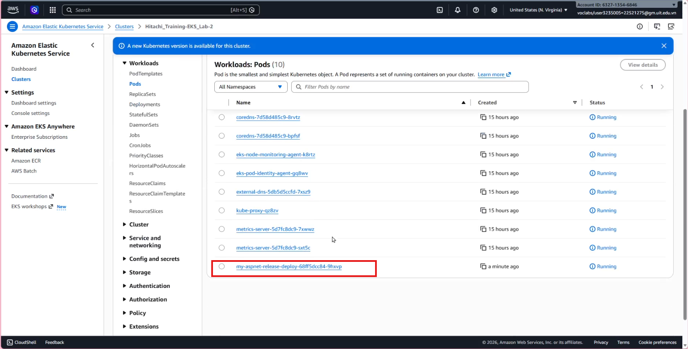
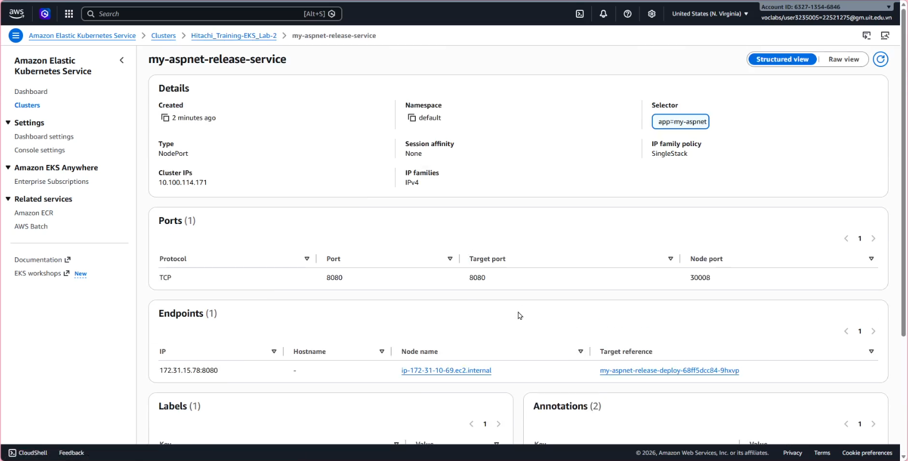
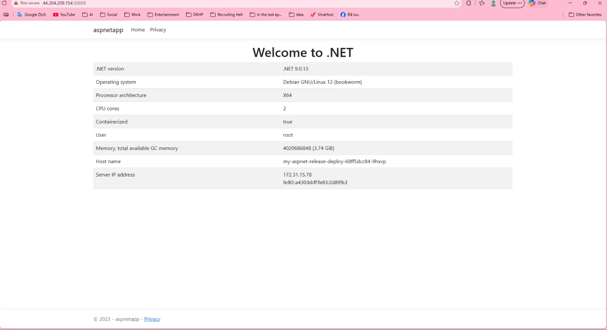

# CI/CD Pipeline Report: Deploying an ASP.NET Application to AWS EKS

## Project Overview
This report documents the end-to-end process of automating the deployment of a web-based online meeting application (ASP.NET) to an Amazon Elastic Kubernetes Service (EKS) cluster. The CI/CD pipeline is orchestrated by **Jenkins**, utilizing **Ansible** for configuration management and **Helm** for Kubernetes resource templating.

## Architecture & Prerequisites
* **Jenkins Controller:** Running inside a Docker container.
* **Jenkins Agent:** Running directly on the Host machine (Ubuntu/EC2) via SSH.
* **Target Environment:** AWS EKS (provisioned via AWS Learner Lab).
* **Tools Installed on Agent:** Docker, AWS CLI, `kubectl`, Helm, and Ansible (v2.15+).

---

## Step-by-Step Implementation Guide

### Step 1: AWS EKS & Authentication Setup (Learner Lab Environment)
Since this project utilizes an AWS Learner Lab account, standard IAM user creation is restricted. We must use temporary session credentials mapped to the `voclabs` role.

1.  **Retrieve Temporary Credentials:** Obtain the `aws_access_key_id`, `aws_secret_access_key`, and `aws_session_token` from the AWS Learner Lab console.
2.  **Configure AWS CLI:** Inject these credentials into the agent machine.
    ```bash
    mkdir -p ~/.aws
    nano ~/.aws/credentials
    ```
    *Paste the credentials block including the session token.*
3.  **Enable Public API Access for EKS:** To prevent `i/o timeout` errors when connecting from an external network, navigate to the AWS Console -> EKS -> Cluster -> Networking, and set the **Cluster endpoint access** to **Public and private**.
4.  **Update Kubeconfig:** Connect the local `kubectl` to the EKS cluster.
    ```bash
    aws eks update-kubeconfig --region <your-region> --name <your-cluster-name>
    ```
5. **Security groups and NACLs:** Ensure that the security groups associated with the EKS cluster allow inbound traffic on necessary ports (e.g., 80 for HTTP, 443 for HTTPS) and that the NACLs are configured to allow traffic from the Jenkins Agent's IP.    

### Step 2: Jenkins SSH Agent Configuration
To allow the Jenkins Controller to execute deployment commands on the Host Agent, we set up an SSH connection using a PEM key.

1.  **Add SSH Key to Jenkins:**
    * Navigate to **Manage Jenkins** > **Credentials** > **System** > **Global credentials**.
    * Create a new credential of type **SSH Username with private key**.
    * Username: `ubuntu` (or your specific host user).
    * Paste the raw contents of the `.pem` file directly into the Private Key field.
2.  **Create the Jenkins Node:**
    * Navigate to **Manage Jenkins** > **Nodes** > **New Node**.
    * Set the **Remote root directory** (e.g., `/home/ubuntu/jenkins-workspace`).
    * Select **Launch agents via SSH**.
    * Provide the Host IP, select the created SSH credential, and set the **Host Key Verification Strategy** to **Non verifying Verification Strategy** to prevent interactive prompt blocks.

### Step 3: Ansible & Helm Configuration
Ansible acts as the bridge that triggers Helm to deploy the application to EKS. I encountered and resolved two critical configuration issues here.

1.  **Ansible Version Upgrade:** The default Ansible version (2.10.8) on older Ubuntu distributions does not support the `kubernetes.core` collection. I upgraded Ansible to the latest version via the official PPA.
2.  **Inventory & Python Interpreter Fix:** To prevent the `hosts matched` skip error and the `python3: not found` fatal error during the Gathering Facts stage, the `inventory.ini` file was explicitly configured to run locally and point to the correct system Python path:
    ```ini
    [local]
    localhost ansible_connection=local ansible_python_interpreter=/usr/bin/python3
    ```

### Step 4: Pipeline Execution (Jenkinsfile)
With the infrastructure and tools properly configured, the deployment is triggered via a Declarative Pipeline.

```groovy
pipeline {
    agent { 
        label 'Host-Agent' // Target the configured SSH Agent
    }

    stages {
        stage('Deploy to EKS') {
            steps {
                dir('/home/ubuntu/ansible') {
                    echo "Executing Ansible Playbook to deploy ASP.NET app via Helm..."
                    sh "ansible-playbook -i inventory.ini deploy-aspnet.yaml"
                }
            }
        }
    }
    post {
        success {
            echo "CI/CD Pipeline completed successfully. Application deployed to EKS."
        }
    }
}
```

## Result:



