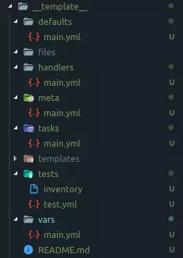

# About Ansible

## Directory Structure

Example directories:
```
ansible-project/
├── ansible.cfg
├── inventory/
│ ├── production
│ └── staging
├── group_vars/
│ ├── all.yml
│ └── webservers.yml
├── host_vars/
│ └── web1.example.com.yml
├── roles/
│ ├── common/
│ ├── webserver/
│ │ ├── tasks/
│ │ │ └── main.yml
│ │ ├── handlers/
│ │ │ └── main.yml
│ │ ├── templates/
│ │ │ └── nginx.conf.j2
│ │ └── vars/
│ │ └── main.yml
│ └── database/
├── playbooks/
│ ├── bootstrap.yml
│ ├── site.yml
│ ├── webserver.yml
│ └── database.yml
```

### Key Files and Directories
- **ansible.cfg**: Configuration file for Ansible settings.
- **inventory/**: Contains inventory files that define the hosts and groups of hosts.
- **group_vars/**: Contains variable files for groups of hosts.
- **host_vars/**: Contains variable files for individual hosts.
- **roles/**: Contains reusable Ansible roles, which are a way to organize tasks,
handlers, files, templates, and variables.
    - Initialize roles directory with `ansible-galaxy init <role_name>` command.



- **playbooks/**: Contains Ansible playbooks, which are YAML files that define the tasks to be executed on the hosts.
    - **bootstrap.yml**: A playbook for bootstrapping the environment, such as installing Ansible on the target hosts.
- **collection**: A collection is a distribution format for Ansible content that can include roles, modules, plugins, and playbooks. Collections allow you to package and distribute your Ansible content in a standardized way.

### Example Playbook

### Ansible Galaxy
Ansible Galaxy is a hub for sharing Ansible roles and collections. You can find pre-built roles for common tasks, such as installing and configuring software, and you can also share your own roles with the community.

## References:
- [Ansible Documentation](https://docs.ansible.com/)
- ["Tìm hiểu Ansible" by Mai Gia Long](https://viblo.asia/p/tim-hieu-ansible-phan-3-yMnKMN0aZ7P)