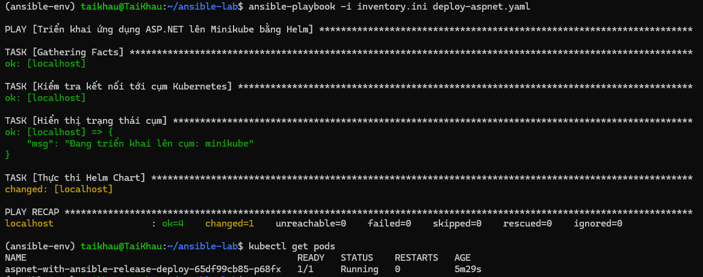
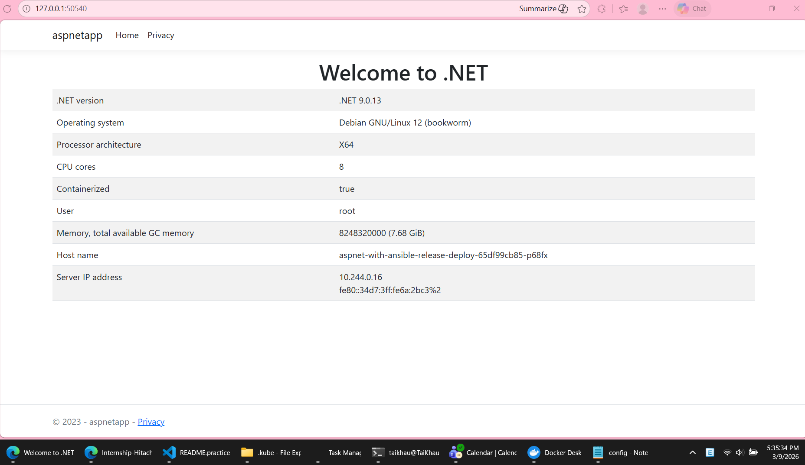

# Practice Ansible

## Prerequisites:
- Ansible is designed to run on Linux/Unix systems. You can use a Linux machine or set up a virtual machine (VM) with a Linux distribution (e.g., Ubuntu, CentOS) to practice Ansible.
- If you are using a Windows machine, you can set up a Linux VM using software like VirtualBox or use the Windows Subsystem for Linux (WSL) to run a Linux environment on your Windows machine.

### Step to set up Ansible on Windows using WSL:
1. Install WSL: Open PowerShell as an administrator and run the following command to enable WSL:
   ```
   wsl --install
   ```
   This will install the default Linux distribution (usually Ubuntu) on your Windows machine.

2. Set up WSL: After the installation is complete, restart your computer and open the WSL terminal (you can search for "Ubuntu" in the Start menu). Follow the prompts to set up your Linux user account.

3. Install Ansible: Once you have your WSL terminal set up, you can install Ansible using the package manager for your Linux distribution. For example, on Ubuntu, you can run:
   ```
   sudo apt update
   sudo apt install ansible
   ```
4. Install Python and pip: Ansible requires Python to run. You can install Python and pip using the following commands:
   ```
   sudo apt install python3 python3-pip
   ```

5. Create virtual environment (optional but recommended): It is a good practice to use a virtual environment for your Ansible projects to manage dependencies. You can create a virtual environment using the following commands:
   ```
   sudo apt install python3-venv python3-full -y
   python3 -m venv ansible-env
   source ansible-env/bin/activate # simply type "deactivate" to exit the virtual environment when you're done
   ```   

6. Install libraries that support Kubernetes and Helm: 
   ```
    pip install kubernetes PyYAML
    ansible-galaxy collection install kubernetes.core   
   ```

### Connecting to a Kubernetes Cluster:
To connect Ansible (in WSL) to Minikube (running on Windows), you need to ensure that the Kubernetes configuration file (kubeconfig) is accessible from WSL. You can do this by copying the kubeconfig file from Windows to WSL.
1. Locate the kubeconfig file on Windows: The kubeconfig file is typically located at `C:\Users\<YourUsername>\.kube\config`.

2. Copy the kubeconfig file to WSL: You can use the `cp` command in WSL to copy the kubeconfig file from Windows to your WSL home directory. For example:
   ```
   mkdir -p ~/.kube
   cp /mnt/c/Users/<YourUsername>/.kube/config ~/.kube/config
   ```

3. Change the path in the kubeconfig file: Open the kubeconfig file in a text editor and update the paths to the certificate files to use the WSL path format. For example, change:
   ```
   certificate-authority: C:\Users\<YourUsername>\.minikube\ca.crt
   client-certificate: C:\Users\<YourUsername>\.minikube\client.crt
   client-key: C:\Users\<YourUsername>\.minikube\client.key
   ```

    - Change the 'C:\Users\<YourUsername>' part to '/mnt/c/Users/<YourUsername>'. The updated paths should look like this:
    ```
    certificate-authority: /mnt/c/Users/<YourUsername>/.minikube/ca.crt
    client-certificate: /mnt/c/Users/<YourUsername>/.minikube/client.crt
    client-key: /mnt/c/Users/<YourUsername>/.minikube/client.key
    ```

4. Test the connection: You can test the connection to the Kubernetes cluster using the `kubectl` command in WSL. For example:
    ```
    kubectl get nodes
    ```
    
    If the connection is successful, you should see a list of nodes in your Minikube cluster.

## Create an Ansible playbook to create a pod on K8s cluster as #2
Below are the steps I did:

1. Prepare directory structure for Ansible playbook:
```
ansible-lab/
├── inventory.ini             # File containing the inventory of hosts (in this case, localhost for WSL)
├── deploy-aspnet.yaml        # Playbook file 
└── my-aspnet-app/            # Helm-chart directory
    ├── Chart.yaml
    ├── values.yaml
    └── templates/
```

2. Create inventory file:
In the *inventory.ini* file, I added the following content to specify that Ansible should run the playbook on the localhost (WSL):
```[local]
localhost ansible_connection=local ansible_python_interpreter=/home/<user_linux>/ansible-env/bin/python3
```

3. Create Ansible playbook:
In the *deploy-aspnet.yaml* file, I added the following content to define the Ansible playbook that will deploy the Helm chart to the Kubernetes cluster:
```yaml---
- name: Triển khai ứng dụng ASP.NET lên Minikube bằng Helm
  hosts: local
  tasks:
    - name: Kiểm tra kết nối tới cụm Kubernetes
      kubernetes.core.k8s_info:
        kind: Node
      register: node_info

    - name: Hiển thị trạng thái cụm
      debug:
        msg: "Đang triển khai lên cụm: {{ node_info.resources[0].metadata.name }}"

    - name: Thực thi Helm Chart
      kubernetes.core.helm:
    name: my-aspnet-release             # Tên của bản release
        chart_ref: ./lab-helm           # Đường dẫn tới thư mục Chart
        release_namespace: default      # Namespace muốn cài đặt
        values:                         # Ghi đè các thông số trong values.yaml (nếu cần)
          replicaCount: 1
          image:
            tag: "v1"
        wait: yes                       # Đợi cho đến khi các Pod ở trạng thái Ready
```

4. Run the Ansible playbook:
To run the Ansible playbook, use the following command in your WSL terminal:
```ansible-playbook -i inventory.ini deploy-aspnet.yaml
```

This command will execute the playbook, which will connect to the Kubernetes cluster and deploy the Helm chart defined in the playbook. You should see output in the terminal indicating the progress of the deployment.

Result:



5. Verify the deployment:
After the playbook has finished running, you can verify that the application has been deployed successfully by checking the status of the pods in your Kubernetes cluster. You can use the following command:
```kubectl get pods
```

You should see a pod running with the name corresponding to your Helm release (e.g., `my-aspnet-release-deploy-xxxxxx`).

6. Access the application:

Result:




