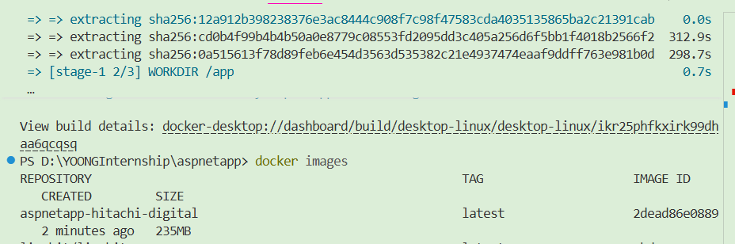
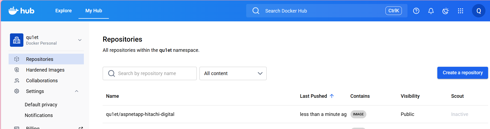
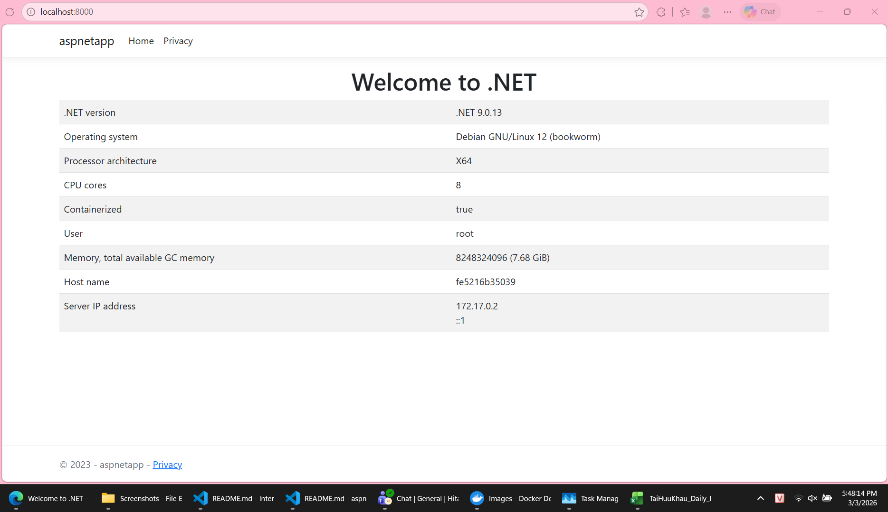

# Practice Docker:

## 1. Setup Docker
This is a script I use for installing Docker:
```
# Add Docker's official GPG key:
sudo apt-get update
sudo apt-get install ca-certificates curl
sudo install -m 0755 -d /etc/apt/keyrings
sudo curl -fsSL https://download.docker.com/linux/ubuntu/gpg -o /etc/apt/keyrings/docker.asc
sudo chmod a+r /etc/apt/keyrings/docker.asc

# Add the repository to Apt sources:
echo \
  "deb [arch=$(dpkg --print-architecture) signed-by=/etc/apt/keyrings/docker.asc] https://download.docker.com/linux/ubuntu \
  $(. /etc/os-release && echo "${UBUNTU_CODENAME:-$VERSION_CODENAME}") stable" | \
  sudo tee /etc/apt/sources.list.d/docker.list > /dev/null
sudo apt-get update

sudo apt-get install -y docker-ce docker-ce-cli containerd.io docker-buildx-plugin docker-compose-plugin

#Manage Docker as a Non-root User (Optional): If want to run Docker commands without using sudo, add  user to the docker group:
sudo groupadd docker
sudo usermod -aG docker ${USER}
newgrp docker
```

## 2. Build a Docker image

### 2.1. Prepare a source code
Here, I will use a sample of an ASPNET web app I found publishing on Github

### 2.2. Prepare Docker file
```
FROM --platform=$BUILDPLATFORM mcr.microsoft.com/dotnet/sdk:9.0 AS build
ARG TARGETARCH
WORKDIR /source

# Copy project file and restore as distinct layers
COPY --link aspnetapp/*.csproj .
RUN dotnet restore -a $TARGETARCH

# Copy source code and publish app
COPY --link aspnetapp/. .
RUN dotnet publish -a $TARGETARCH --no-restore -o /app

# Runtime stage
FROM mcr.microsoft.com/dotnet/aspnet:9.0
EXPOSE 8080
WORKDIR /app
COPY --link --from=build /app .
USER root 
# $APP_UID
ENTRYPOINT ["./aspnetapp"]
```

**Explaination:**
- Above is a multi-stage build Dockerfile which have 2 stages: Build stage and Runtime stage.
- In Build stage, using *dotnet/sdk:9.0*  image to build source code into executable file. 
- Then, running *dotnet restore*, *dotnet publish*, now all the things that needed to run the application stay in the */app* directory.
- In Runtime stage, using *dotnet/aspnet:9.0* image, which is the "minimal version", only have enough libraries for running the compiled file and does not include the compiler inside.
- Use *COPY --link --from=build /app .* to take the "things-that-needed-to-run-the-app" that we got from stage 1, and then finally, defaultly run the app when the container is up.
- In this way, all the original source code and SDK from Stage 1 will be removed. The final image that we use will only contain Stage 2, which will be lighter and more secure because there will be less "tools" included in the image for the hacker to take advantage of.

### 2.3. Build Docker image

To build the Docker image, run the following command:

```
docker build -t <wanted_name_for_the_image> <build_context_directory>
```

Then check if the image is successfully created or not:
```
docker images
```

In my case, the image was created:
<!--  -->
 

## 3. Publish Docker image to registry

### 3.1. Authenticate to the registry
- First, log in to the registry, for Dockerhub - the default registry, simply run:
```
docker login
```
- For a different or private registry, specify the registry's login server URL (e.g., myregistry.azurecr.io or ghcr.io):
```
docker login [REGISTRY_URL]
```

- And for AWS ECR, arcording to Amazon documentation:
```
aws ecr get-login-password --region <region> | docker login --username AWS --password-stdin <aws_account_id>.dkr.ecr.<region>.amazonaws.com
```
- The above command will get a password from AWS and then use it for the *docker login* command.

### 3.2. Tag the Docker image
- Tag the Docker image before push with the following format:
```
docker tag LOCAL_IMAGE_NAME:TAG REGISTRY_URL/NAMESPACE/IMAGE_NAME:TAG
```

- Example for Dockerhub:
```
docker tag aspnetapp-hitachi-digital:latest dockerhubs_username/aspnetapp-hitachi-digital:v1
```

- Example for AWS ECR:
```
docker tag aspnetapp-hitachi-digital:latest aws_account_id.dkr.ecr.region.amazonaws.com/aspnetapp-hitachi-digital:v1
```

### 3.3. Push the image to the Registry
- Use the *docker push* command as follow:
```
docker push REGISTRY_URL/NAMESPACE/IMAGE_NAME:TAG
```

- Example for Dockerhub:
```
docker push myusername/aspnetapp-hitachi-digital:v1
```

- Example for AWS ECR:
```
docker push aws_account_id.dkr.ecr.region.amazonaws.com/aspnetapp-hitachi-digital:v1
```

- My result after push to Dockerhub:


## 4. Run a container from an image on registry
- If using a private registry, we will need to do the login step like above, but if with the public registry like Dockerhub, login in is not nesscessary.
- Run the container with the following command:
```
docker run [OPTIONS] <registry_login_server>/<image_name>:<tag>
```

- There are some common options that I'm ussually use like:
    - *-d*: Runs the container in the background (detached mode).
    - *-p <host_port>:<container_port>*: Publishes the container's port to a specified port on the host machine (e.g., -p 8080:80 for a web server).
    - *--name <container_name>*: Assigns a custom name to the container.
    - *--rm*: Automatically removes the container as soon as we stop it (press Ctrl+C).
    - *-it*: A combination of -i (interactive) and -t (tty). It allows to interact with the container. It will help us see log entries displayed directly in the terminal and we can stop the application using a keyboard shortcut.
    - *-e ENV_VAR=XXXX*: Sets the environment variable. (Environment Variable)

- Example, in my case:
```
docker run --rm -it -p 8000:8080 -e ASPNETCORE_HTTP_PORTS=8080 qu1et/aspnetapp-hitachi-digital:v1
```

- The result:

