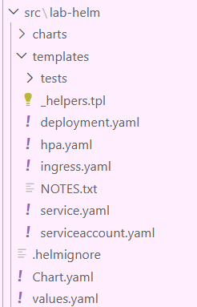
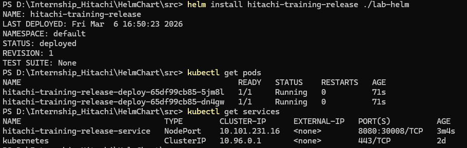
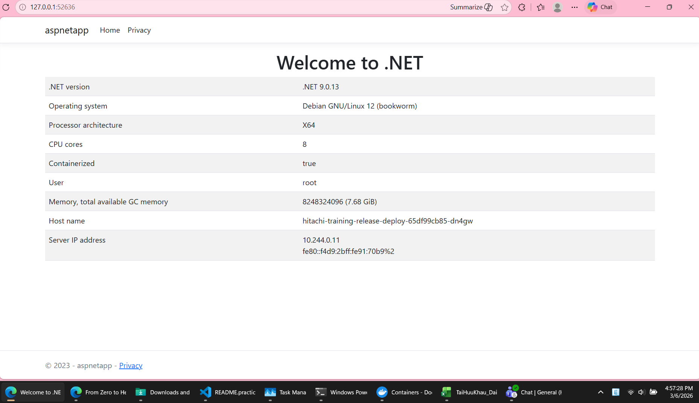

# Practice Helm-chart

##  Create a Helm-chart to create a pod on K8s cluster as #2

Below are the steps I did:

1. Start by create a helm-chart using:
```
helm create lab-helm
```

That will create a folder named *lab-helm* with the structure as follow:



*See the (./README.overview.md) to know more about the structure*

But because the requiment for this lab is basic, so, inside the *templates/* directory, let's me just keep only these 2 files: *deployment.yaml*, *service.yaml*.

2. Customize the Deployment

- Define how our Pod will be run with *deployment.yaml* file:

```yaml
apiVersion: apps/v1
kind: Deployment
metadata:
  name: {{ .Release.Name }}-deploy
spec:
  replicas: {{ .Values.replicaCount }}
  selector:
    matchLabels:
      app: my-aspnet
  template:
    metadata:
      labels:
        app: my-aspnet
    spec:
      containers:
        - name: aspnet-container
          image: {{ .Values.image.repository }}:{{ .Values.image.tag }}
          ports:
            - containerPort: {{ .Values.service.port }}
          env:
            - name: ASPNETCORE_HTTP_PORTS
              value: {{ .Values.service.port | quote }}
```              

- To access the Pod from outside, let's customize *service.yaml* file:

```yaml
apiVersion: v1
kind: Service
metadata:
  name: {{ .Release.Name }}-service
spec:
  type: {{ .Values.service.type }}
  ports:
    - port: {{ .Values.service.port }}
      targetPort: {{ .Values.service.port }}
      nodePort: 30008 # Cổng để truy cập từ trình duyệt
  selector:
    app: my-aspnet
```

- Customize enviroment varialbes with "values.yaml" file:

```yaml
replicaCount: 2

image:
  repository: qu1et/aspnetapp-hitachi-digital
  tag: v1

service:
  type: NodePort
  port: 8080
```

- Finally, deploy onto Minikube:

    - Change directory to be at [parent folder](./src) of [our Chart](./src/lab-helm).

    - Use the following *Helm* command to install the *Chart* onto K8s (or in this case, Minikube):
    ```
    helm install [RELEASE_NAME] [CHART_NAME]

    ```

    - Example, in my case:
    ```
    helm install hitachi-training-release ./lab-helm 
    ```

    - Get the URL to access the app:
    ```
    minikube service hitachi-training-release-service --url
    ```

    - Check the result:






