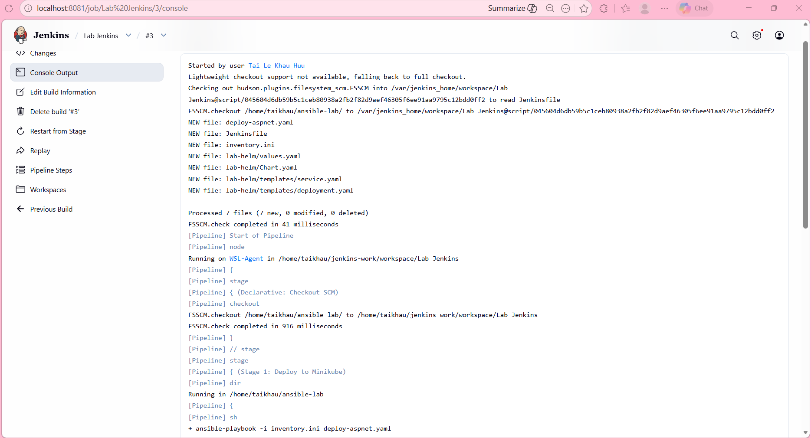
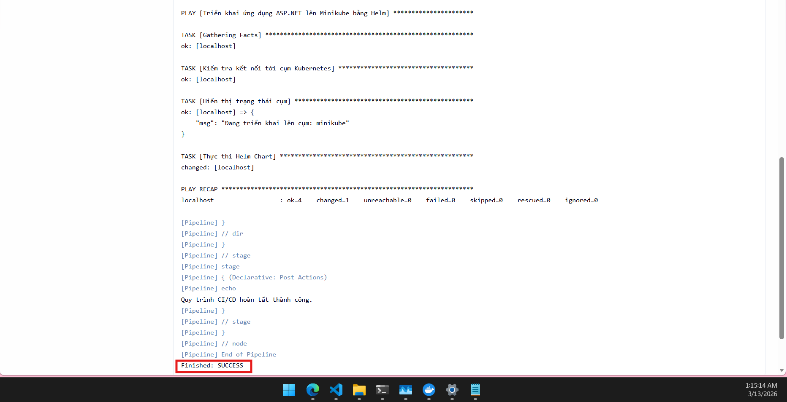
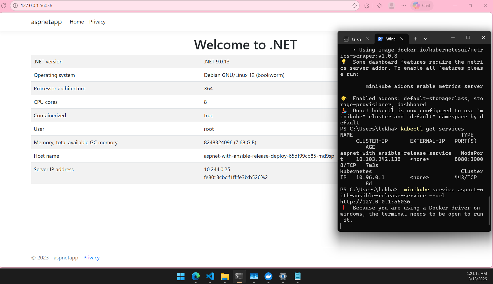

# Practice Jenkins
##  Setup a Jenkins server
I will create a Jenkins server using Docker inside WSL. I will use the official Jenkins image from Docker Hub.

1. Create docker-compose.yml file with the following content:

```yaml
services:
  jenkins:
    image: jenkins/jenkins:2.554-jdk21
    container_name: jenkins-master
    privileged: true
    user: root
    ports:
      - "8081:8080" # Truy cập Jenkins qua cổng 8081
      - "50000:50000"
    volumes:
      - ./jenkins_home:/var/run/jenkins_home
      - /var/run/docker.sock:/var/run/docker.sock # Cho phép Jenkins dùng Docker của máy chủ
      - /usr/bin/docker:/usr/bin/docker           # Chia sẻ lệnh docker
      - /home/<user_linux>/.kube:/root/.kube      # Chia sẻ cấu hình K8s (đã sửa đường dẫn)
      - /home/<user_linux>/ansible-env:/ansible-env # Chia sẻ môi trường ảo Ansible
      - /home/<user_linux>/ansible-lab:/home/<user_linux>/ansible-lab
    environment:
      - TZ=Asia/Ho_Chi_Minh
```

2. Run the Jenkins container:

```bash
docker-compose up -d
```

3. Access Jenkins
After running the above command, Jenkins will be accessible at `http://localhost:8081`. You can log in using the initial admin password found in the `jenkins_home` directory, or use the following command to retrieve it:

```bash
docker exec jenkins-master cat /var/jenkins_home/secrets/initialAdminPassword
```

4. Install necessary plugins
Paste the password and install suggested plugins. After that, create an admin user for future logins.

### Configure agent node
I will configure an agent node to run Ansible playbooks. I will use the WSL environment as the agent node (Because I have installed Helm and Ansible on it in the previous lab, but if not, you must remember to install them). To do this, I will install the "SSH Slaves" plugin in Jenkins and set up an SSH connection to the WSL environment.

1. Install "SSH Server" on WSL:

```bash 
sudo apt update && sudo apt install openssh-server -y
sudo nano /etc/ssh/sshd_config # Tìm dòng PasswordAuthentication và đổi thành yes.
sudo service ssh restart
```

2. Check the IP address of WSL:

```bash
ip addr show eth0
```

or 

```bash
hostname -I
```

3. Add a new node in Jenkins:
- Go to "Manage Jenkins" > "Manage Nodes and Clouds" > "New Node".
- Enter a name for the node, select "Permanent Agent", and click "OK".
- Configure the node with the following settings:
- Remote root directory: `/home/<user_linux>/jenkins-work`
- Labels: `wsl-node`
- Launch method: "Launch agents via SSH"
- Host: IP address of WSL **(But in this lab, because we are using WSL, we will use the "host.docker.internal" hostname.)**
- Credentials: Add new credentials with the username and password of your WSL user.
**- Make sure to install java in WSL to run the Jenkins agent. You can do this with:**
```bash
sudo apt update && sudo apt install openjdk-21-jdk -y
```

## Create a pipeline to run Ansible playbook created in #5

### Reprequisites
Make sure that the following informations are configured in Jenkins Credential:
- SSH credentials for the WSL agent node.
- Install JVM in WSL to run the Jenkins agent. You can do this with:
```bash
sudo apt update && sudo apt install openjdk-21-jdk -y
```

### Create a Jenkins pipeline
1. Create a Jenkinsfile in the root of your project with the following content:

**Note: Make sure to mount the Ansible environment in the Jenkins container as shown in the docker-compose.yml file, and adjust the path to the Ansible playbook accordingly. In this example, I assume that the Ansible playbook is located in `/home/taikhau/ansible-lab` inside the Jenkins container.**

```groovy
pipeline {
    agent { label 'wsl-node' }

    stages {
        stage('Stage 1: Deploy to Minikube') {
            steps {
                dir('/home/taikhau/ansible-lab') { 
                    sh "ansible-playbook -i inventory.ini deploy-aspnet.yaml"
                }
            }
        }
    }

    post {
        success {
            echo "Quy trình CI/CD hoàn tất thành công."
        }
        failure {
            echo "Có lỗi xảy ra. Hãy kiểm tra lại Log."
        }
    }
}
```

2. Create a Pipeline job in Jenkins:
- Go to Jenkins dashboard, click "New Item", enter a name for the job, select "Pipeline", and click "OK".
- In the pipeline configuration, select "Pipeline script from SCM", choose "Git", and enter the repository URL where your Jenkinsfile is located.
- Save the configuration.

3. Run the pipeline
- Click "Build Now" to start the pipeline. Jenkins will execute the stages defined in the Jenkinsfile, building the Docker image, pushing it to Docker Hub, and deploying it to Minikube using Ansible.

**- We can configure the pipeline to run automatically on code changes by setting up a webhook in GitHub that triggers the Jenkins job whenever there is a new commit. But because we are using local WSL, we will not be able to set up a webhook in this lab. (I will do this in the next lab when we on the AWS)**

## The final result:




As you can see, the pipeline executed successfully, and the ASP.NET application was deployed to Minikube with Ansible. We can verify this by accessing the application through the Minikube IP address and the NodePort assigned to the service.

