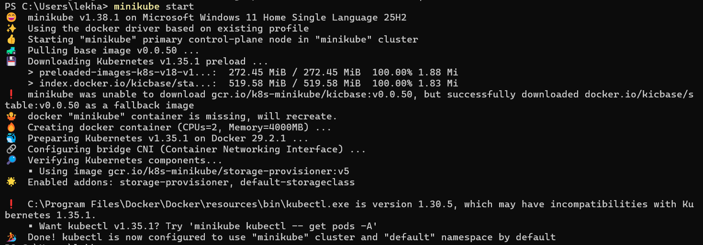
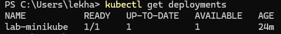
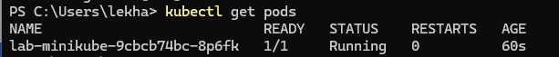
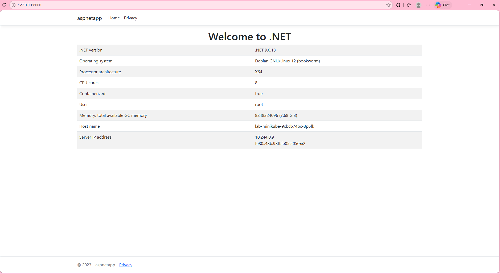
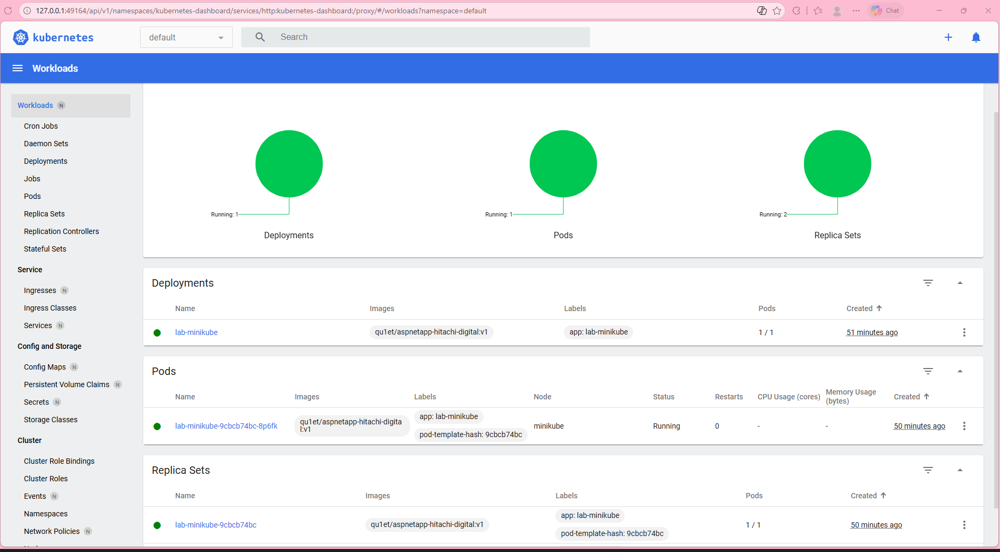

# Practice K8s (local)
## 1. Install minikube
- I will do this lab on Windows enviroment.
- According to the official documentation, here are the steps to install minikube:
    - Download and run the installer from the link given.
    - Add the minikube.exe binary to enviroment *PATH*.
## 2. Start local cluster on minikube
- To start the cluster, use these following command:
```
minikube start
```

- Result:


## 3. Install kubectl
According to the instruction on kubernetes documentation page:
- You have two options for installing kubectl on your Windows device
    - Direct download:
    Download the latest 1.35 patch release binary directly for your specific architecture by visiting the Kubernetes release page. Be sure to select the correct binary for your architecture (e.g., amd64, arm64, etc.).

    - Using curl:
    If you have curl installed, use this command:
    ```
    curl.exe -LO "https://dl.k8s.io/release/v1.35.0/bin/windows/amd64/kubectl.exe"
    ```

- Append or prepend the kubectl binary folder to your PATH environment variable.
- Test to ensure the version of kubectl is the same as downloaded:
```
kubectl version --client
```
Or use this for detailed view of version:
```
kubectl version --client --output=yaml
```

**Note:**
Docker Desktop for Windows adds its own version of kubectl to PATH. If you have installed Docker Desktop before, you may need to place your PATH entry before the one added by the Docker Desktop installer or remove the Docker Desktop's kubectl.

## 4. Start a pod on K8s cluster with image built in Docker tasks #1
I followed the steps:
- Create a minikube cluster:
```
minikube start
```

- Check the status ò the minikube cluster:
Verify the status of the minikube cluster to ensure all the components are in a running state.
```
minikube status
```

The output from the above command should show all components Running or Configured, as shown in the example output below:
```
minikube
type: Control Plane
host: Running
kubelet: Running
apiserver: Running
kubeconfig: Configured
```
- Open the Dashboard:
Open a new terminal, and run:
```
# Start a new terminal, and leave this running.
minikube dashboard --url
```

Now, you can use this URL and switch back to the terminal where you ran minikube start.

- Create a Deployment
According to kubernetes documentation:
*A Kubernetes Pod is a group of one or more Containers, tied together for the purposes of administration and networking. The Pod in this tutorial has only one Container. A Kubernetes Deployment checks on the health of your Pod and restarts the Pod's Container if it terminates. Deployments are the recommended way to manage the creation and scaling of Pods.*

1. Use the *kubectl create* command to create a Deployment that manages a Pod. The Pod runs a Container based on the provided Docker image.
```
#Run a container image from task 1: Docker
kubectl create deployment lab-minikube --image=qu1et/aspnetapp-hitachi-digital:v1 
```

2. Set the environment variable.
```
kubectl set env deployment/lab-minikube ASPNETCORE_HTTP_PORTS=8080
```

3. Forward port in order to access
*In Docker, the computer and the container are directly connected. In K8s, the container is in a Pod, and the Pod is in a Minikube virtual node. To map the physical machine's port 8000 to the Pod's port 8080, let's run this command in a new terminal:*
```
kubectl port-forward deployment/lab-minikube 8000:8080
```

4. View the Deployment:
```
kubectl get deployments
```

The output:

*(It may take some time for the pod to become available. If you see "0/1", try again in a few seconds.)*

5. View the Pod:
```
kubectl get pods
```

The output:


6. Debugging:
- To view cluster events:
```
kubectl get events
```

- To view the kubectl configuration:
```
kubectl config view
```

- To view application logs for a container in a pod (replace pod name with the one you got from kubectl get pods).
```
kubectl logs some-things-123456abcd-efgh
```

5. The result:
The app is deployed successfully:


And you can see the related information on dashboard like Workload, Service, Config and Storage, Cluster,...



## 5. Hand-on with K8s CLI
Key kubectl Commands for Hands-On Practice
- Cluster Information:
```
kubectl cluster-info # Check cluster status.
```
```
kubectl get nodes # List worker nodes.
```

- Pod Management:
```
kubectl run <pod-name> --image=<image> # Run a new pod.
```
```
kubectl get pods # List all pods.
```
```
kubectl describe pod <pod-name> # Detailed pod information.
```
```
kubectl delete pod <pod-name> #  Delete a pod.
```
- Deployments & Scaling:
```
kubectl create deployment <name> --image=<image> # Deploy an application.
```
```
kubectl get deployments # List deployments.
```
```
kubectl scale --replicas=<num> deployment/<name> # Scale replicas.
```
- Networking & Debugging:
```
kubectl expose deployment <name> --port=<port> --type=NodePort # Expose a service.
```
```
kubectl port-forward <pod-name> <local-port>:<pod-port> # Access apps locally.
```
```
kubectl logs <pod-name> # View container logs
```
## References:
https://minikube.sigs.k8s.io/docs/start/
https://kubernetes.io/docs/tutorials/hello-minikube/