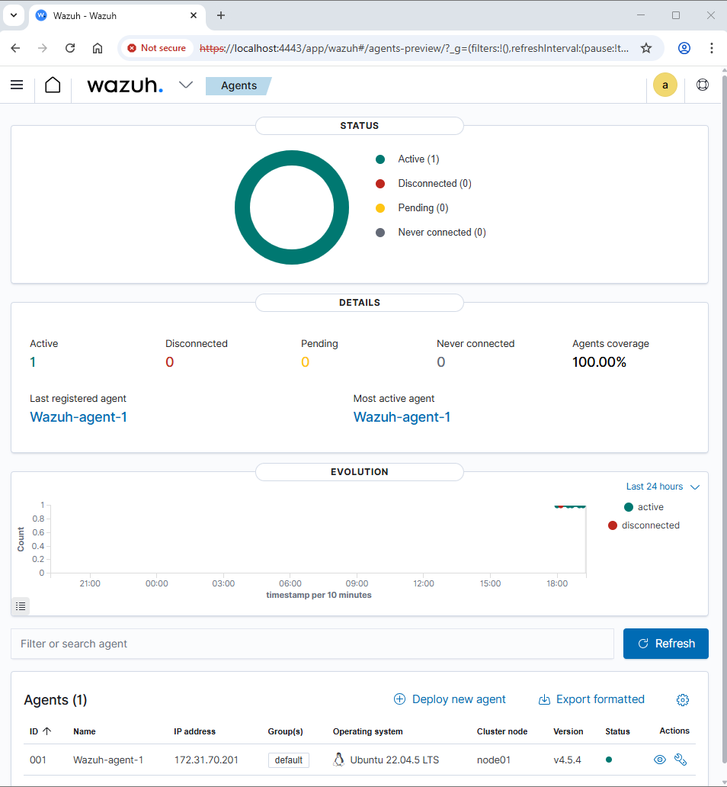
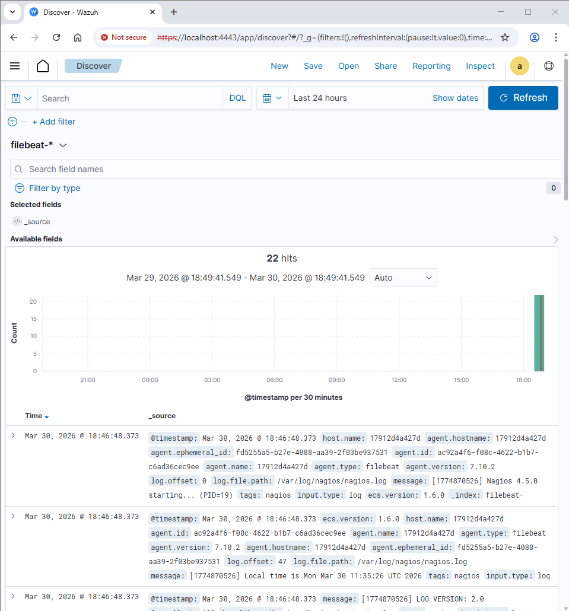

# Wazuh and Nagios Installation and Configuration Guide

This README details the steps to install and configure Wazuh and Nagios using Docker Compose, including integrating Nagios logs into the Wazuh Indexer. It also documents the challenges faced during the deployment and their respective solutions.

## 1. Installing Wazuh Manager (Docker Compose)

The deployment uses Docker Compose to run Wazuh components in isolated containers rather than a direct bare-metal installation.

**Step 1: Prepare the Environment**
*   **Increase virtual memory**: Elasticsearch/Wazuh Indexer requires a sufficient amount of virtual memory to start.
    ```bash
    sudo sysctl -w vm.max_map_count=262144
    echo "vm.max_map_count=262144" | sudo tee -a /etc/sysctl.conf
    ```
*   **Install Docker and Docker Compose**:
    ```bash
    sudo apt-get update
    sudo apt-get install docker.io docker-compose -y
    ```

**Step 2: Download Wazuh Docker Compose Configuration**
*   Clone the official Wazuh Docker repository for version **4.5.4** and navigate to the single-node directory.
    ```bash
    git clone https://github.com/wazuh/wazuh-docker.git -b v4.5.4
    cd wazuh-docker/single-node
    ```

**Step 3: Generate Security Certificates**
*   Run the provided temporary container to automatically generate certificates for all nodes and mount them to the correct volumes.
    ```bash
    sudo docker-compose -f generate-indexer-certs.yml run --rm generator
    ```

**Step 4: Start the System**
*   Start all containers in the background.
    ```bash
    sudo docker-compose up -d
    ```

**Step 5: Access the Dashboard**
*   Access the interface at `https://<Ubuntu_Server_IP>` using the default credentials (`admin` / `SecretPassword`).

## 2. Installing the Wazuh Agent

**Step 1: Install the Agent Package**
*   Download the GPG key, add the repository, and install the specific agent version (**4.5.4-1**) to ensure it matches the manager.
    ```bash
    curl -s https://packages.wazuh.com/key/GPG-KEY-WAZUH | gpg --no-default-keyring --keyring gnupg-ring:/usr/share/keyrings/wazuh.gpg --import && chmod 644 /usr/share/keyrings/wazuh.gpg
    echo "deb [signed-by=/usr/share/keyrings/wazuh.gpg] https://packages.wazuh.com/4.x/apt/ stable main" | tee -a /etc/apt/sources.list.d/wazuh.list
    apt-get update
    WAZUH_MANAGER="<WAZUH_SERVER_IP>" apt-get install wazuh-agent=4.5.4-1 -y
    ```

**Step 2: Start the Agent**
*   Reload the daemon, enable, and start the agent service.
    ```bash
    systemctl daemon-reload
    systemctl enable wazuh-agent
    systemctl start wazuh-agent
    ```

**Results:**



## 3. Integrating Nagios with Wazuh Indexer

Nagios can be integrated directly with the Wazuh Indexer without requiring a separate ELK stack, saving CPU, RAM, and disk resources. 

**Step 1: Prepare SSL Certificates**
*   Create a directory and copy the `root-ca.pem` from the Wazuh installation so Filebeat can authenticate with the Wazuh Indexer.
    ```bash
    mkdir -p ~/nagios-filebeat/certs
    sudo cp ~/wazuh-docker/single-node/config/wazuh_indexer_ssl_certs/root-ca.pem ~/nagios-filebeat/certs/
    sudo chmod 644 ~/nagios-filebeat/certs/root-ca.pem
    ```

**Step 2: Configure Filebeat**
*   Create a `filebeat.yml` file to read Nagios logs (`/var/log/nagios/nagios.log`) and output them to the Wazuh Indexer at `https://<WAZUH_INDEXER_IP>:9200`. Disable ILM since OpenSearch does not use Elastic's ILM.

**Step 3: Create Docker Compose for Nagios & Filebeat**
*   Create a `docker-compose.yml` defining the `nagios_core` container (port 8080) and the `filebeat_nagios` container, sharing a volume for logs. Ensure `filebeat.yml` has root ownership before running.
    ```bash
    sudo chown root:root filebeat.yml
    sudo chmod 644 filebeat.yml
    sudo docker-compose up -d
    ```

**Step 4: View Data on Wazuh Dashboard**
*   In the Wazuh Dashboard, navigate to **Stack Management -> Index Patterns**, and create a pattern named `filebeat-*` to visualize Nagios monitoring logs.

**Results:**



---

## 4. Difficulties Encountered and Resolutions

### Issue 1: SSL/TLS Incomplete Certificate Chain Error
*   **Problem:** When attempting to access the dashboard or download packages, an `IncompleteCertChain` or `Blocked by SSL_INCOMPLETE_CHAIN` error occurred.
*   **Cause:** This was caused by corporate firewalls/proxies performing SSL Inspection without the Root CA being trusted by the Ubuntu server, or outdated `ca-certificates` on the host.
*   **Resolution:** Instead of disabling SSL (which would crash the Wazuh nodes), an **SSH Tunnel** was created from the local machine to bypass the network filter.
    ```bash
    ssh -L 4443:localhost:443 ubuntu@<AWS_SERVER_IP> -i <key.pem>
    ```
    The dashboard was then securely accessed via `https://localhost:4443`.

### Issue 2: Agent Version Mismatch and IP Reconfiguration
*   **Problem:** The wrong Wazuh Agent version was initially installed, and there was a need to dynamically change the Manager's IP address later.
*   **Resolution:**
    *   **Downgrading:** The incorrect agent was completely purged (`sudo apt-get remove --purge wazuh-agent -y`), and the exact version (`4.5.4-1`) was installed and locked using `sudo apt-mark hold wazuh-agent` to prevent accidental upgrades.
    *   **Changing IP:** The Manager IP was updated directly in `/var/ossec/etc/ossec.conf` between the `<address>` tags, followed by a service restart (`sudo systemctl restart wazuh-agent`).

### Issue 3: Agent Failing to Connect to the Dashboard
*   **Problem:** The Wazuh Agent did not appear on the Wazuh Dashboard after installation.
*   **Cause:** AWS Security Groups blocked inbound traffic, or the public IP was used instead of the private IP for machines in the same VPC.
*   **Resolution:** Two Custom TCP rules were added to the AWS Security Group of the Wazuh Manager to open **Port 1515** (Enrollment) and **Port 1514** (Communication). The `ossec.conf` was also updated to use the Manager's Private IP.

### Issue 4: Filebeat Compatibility Error with OpenSearch
*   **Problem:** The Filebeat container failed to send logs, throwing a `400 Bad Request` error: `Invalid index name [_license]`.
*   **Cause:** Newer versions of Filebeat (e.g., 7.17.13) include a mandatory license check API (`/_license`) imposed by Elastic. Since Wazuh Indexer is based on OpenSearch, it does not support this proprietary endpoint, causing Filebeat to immediately disconnect.
*   **Resolution:** The Filebeat image in `docker-compose.yml` was **downgraded to OSS version 7.10.2** (`docker.elastic.co/beats/filebeat-oss:7.10.2`), which is the last fully open-source version compatible with Wazuh Indexer. The container was then recreated using `sudo docker-compose up -d --force-recreate filebeat`.


